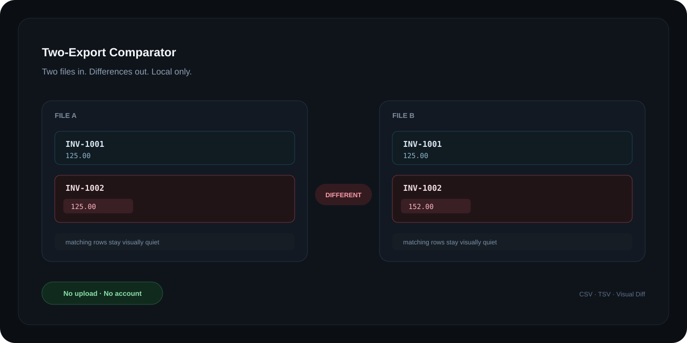

# Two-Export Comparator

[English](README.md) · [Latviešu](README.lv.md)



> **Two files in. Differences out.**  
> A privacy-first browser tool that compares two CSV/TSV exports locally and shows the differences side by side.

**Status:** pre-release / active development

## Why this exists

Comparing exports should not require a spreadsheet formula maze, a cloud upload, or a data-engineering background.

Two-Export Comparator is built around one simple workflow:

```text
Drop File A + File B
        ↓
Automatic local analysis
        ↓
Side-by-side Visual Diff
        ↓
Red = different
Neutral / blue = matching
        ↓
Export the result
```

The normal user should not need to understand matching algorithms, normalization rules, or column-mapping terminology. The app attempts to do that work automatically. Manual mapping remains available only as **Expert settings**.

## What it looks for

The comparison engine can classify records as:

| Status | Meaning |
| --- | --- |
| `MATCHED` | A unique pair was found and the compared values match. |
| `MISMATCH` | The same record was found in both files, but one or more values differ. |
| `ONLY_A` | The record exists only in File A. |
| `ONLY_B` | The record exists only in File B. |
| `DUPLICATE` | A normalized key appears multiple times. |
| `AMBIGUOUS` | A unique safe pairing cannot be determined. The engine does not guess. |

## Current capabilities

- CSV and TSV input
- comma, semicolon and tab delimiter detection
- quoted CSV fields
- multiline quoted values
- UTF-8 and UTF-8 BOM handling
- basic type inference for text, numbers and dates
- automatic column-pair suggestions
- deterministic local comparison
- numeric tolerance
- duplicate and ambiguity detection
- source-row traceability
- side-by-side Visual Diff
- CSV result export
- English and Latvian UI
- contributor-friendly locale registry

## Privacy by architecture

Business exports can contain sensitive information. The application is designed so the normal comparison flow does not require sending those files anywhere.

- files are read in the browser;
- file contents are not uploaded by the application;
- there is no account requirement;
- imported business data is not stored in an application database;
- no analytics or telemetry is required for comparison;
- imported values are rendered with safe DOM APIs;
- refreshing or closing the page clears in-memory file data.

This describes the architecture. It is **not** a blanket legal claim such as “100% GDPR compliant”.

## Quick start

Requirements:

- a current Node.js version
- npm

```bash
git clone https://github.com/QvarcY/two-export-comparator.git
cd two-export-comparator
npm install
npm test
npm run dev
```

Production build:

```bash
npm run build
npm run preview
```

## How automatic matching works

The app analyzes column names, inferred data types, value overlap and uniqueness to suggest which columns represent the same concept across both files.

Examples:

```text
Reference   ↔ Payment Ref
Amount      ↔ Total
Date        ↔ Paid Date
```

The first strong identifier candidate is used to pair records. Additional compatible pairs are used for comparison.

Automatic suggestions are intentionally conservative. If the app cannot determine a safe mapping, the user can open **Expert settings** instead of the engine silently guessing.

## Supported input

Current target:

- `.csv`
- `.tsv`
- UTF-8 / UTF-8 BOM
- up to 50 MiB per file in the current MVP

Planned formats such as XLSX should only be added after the core CSV/TSV workflow is stable.

## Project scope

This project intentionally stays small.

**Core promise:**

> Take two files and visually show what is different.

The project should not become an ERP, CRM, accounting suite, cloud workspace, BI platform, or file-storage service.

Before adding a feature, ask:

> Does this help the user understand the differences between two files faster?

If the answer is no, it probably does not belong in the core product.

See [PROJECT_SCOPE.md](docs/PROJECT_SCOPE.md).

## Architecture

```text
src/
├── app/          state + application controller
├── engine/       parsing, normalization, mapping and comparison logic
├── i18n/         locale registry and translations
├── models/       DTO / service contracts
├── services/     browser comparison service
├── ui/
│   ├── components/
│   ├── renderers/
│   └── views/
└── styles/
```

The UI depends on the `ComparisonService` boundary rather than parser internals. This keeps technical comparison logic out of UI components.

## Development principles

- one focused job, done well;
- local-first where practical;
- no silent guessing with ambiguous data;
- minimal dependencies;
- safe rendering of imported values;
- accessible controls;
- deterministic comparison before AI;
- regression tests must fail when the protected behavior is broken.

## Languages

Official UI languages:

- English (`en`)
- Latviešu (`lv`)

Adding another language does not require changing comparison logic.

See [Translation guide](docs/TRANSLATIONS.md).

README translations may be added as `README.xx.md`.

## Roadmap

The canonical development ledger is [ROADMAP.md](ROADMAP.md).

Current direction:

1. ✅ project architecture and frontend foundation
2. ✅ Visual Diff as the primary UX
3. ✅ real local CSV/TSV engine MVP
4. 🟡 harden matching and normalization
5. ⬜ export/privacy/security review
6. ⬜ accessibility, performance and regression quality gate
7. ⬜ static/offline distribution
8. ⬜ public release

Every meaningful development round updates `ROADMAP.md`.

## Contributing

Contributions are welcome, especially for:

- parser edge cases;
- deterministic matching;
- test fixtures;
- accessibility;
- performance;
- security hardening;
- translations;
- documentation.

Please read [CONTRIBUTING.md](CONTRIBUTING.md) before opening a PR.

## Security

Please do not publish sensitive business exports in issues, pull requests, screenshots, or fixtures.

See [SECURITY.md](SECURITY.md).

## License

MIT — see [LICENSE](LICENSE).
